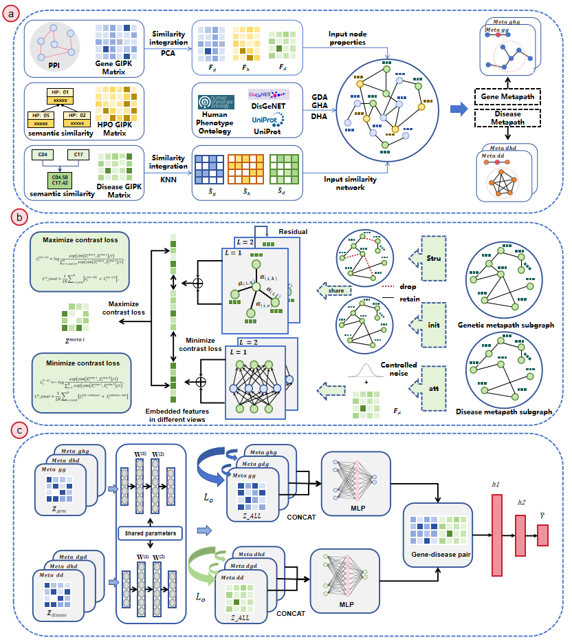

# HMCGDA
**Gene-Disease Association Prediction with Metapath Enhancement and Contrastive Learning in Heterogeneous Graph**

\
Fig. 1. Workflow of the HMCGDA model. (a) Construct gene-phenotype-disease heterogeneous graph and metapath subgraph. (b) Generate enhanced view, extract features and aggregate to get node embeddings. (c) Enhance the metapath embedding, generate gene-disease pair representation and predict the results.

# Dependencies
Our model is implemented by Python 3.6 with Pytorch 1.4.0 and run on Nvidia GPU with CUDA 10.0
- pytorch==1.10.1
- numpy==1.19.5
- sklearn==1.1.5
- pandas=2.0.0
- scipy==1.5.4
- torch-geometric==2.0.3
- torch-scatter==2.0.9
- torch-sparse==0.6.12
- torch-spline-conv==1.2.1
# Data
* Data files used in the HMCGDA model.

###fold
* Inside this folder are different folding element path subgraphs.\
    ``adj_meta_ghg.plk：`` Subgraph adjacency matrix of the metapath ghg\
    ``adj_meta_gdg.plk：`` Subgraph adjacency matrix of the metapath gdg\
    ``adj_meta_dhd.plk：`` Subgraph adjacency matrix of the metapath dhd\
    ``adj_meta_dgd.plk：`` Subgraph adjacency matrix of the metapath dgd 
###node_features
* This file contains the feature matrices of the nodes.\
    ``gene_pac_feature_new_512.npy：`` Eigenvector Matrix of Gene Nodes\
    ``hpo_pac_feature_512.npy：`` Eigenvector Matrix of Hpo Nodes\
    ``disease_pac_feature_new_512.npy：`` Eigenvector Matrix of Disease Nodes
###relation_edge
* This file contains the adjacency matrix of all subrelationships in the isomorphism map.\
    ``adj_gg.plk：`` Gene-Gene Association\
    ``adj_gh.plk：`` Gene-HPO Association\
    ``adj_gd.plk：`` Gene-Disease Association\
    ``adj_hg.plk：`` HPO-Gene Association\
    ``adj_hh.plk：`` HPO-HPO Association\
    ``adj_hd.plk：`` HPO-Disease Association\
    ``adj_dg.plk：`` Disease-Gene Association\
    ``adj_dh.plk：`` Disease-HPO Association\
    ``adj_dd.plk：`` Disease-Disease Association
###sample
* The file contains a collection of label samples used in five-fold cross-validation.\
    ``fold_X.json：`` The label sample set of the X-th fold.

###singe_node_num
*This file contains the node IDs of genes, phenotypes, and diseases, along with their corresponding ontology mappings.\
    ``gene_num.json：`` <number, ontology>\
    ``num_gene.json：`` <ontology, number>

# code
**Python implementation files for HMCGDA**

     1. code/main.py - The main file of the model, run the file model run.

     2. code/utils.py - A file of model loading data, which includes loading heterogeneous networks, sample sets, node feature sets, and comparative learning positive and negative sample sets.

     3. code/model.py and code/meta_mode_feature_create_graph.py - The main model methods file, where the model implementation methods are located.

# Run
 * The required packages can be installed by running `pip install -r requirements.txt`.
 * python main.py

